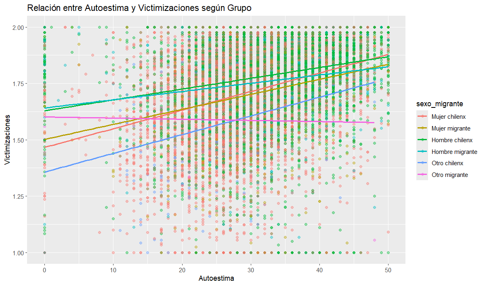
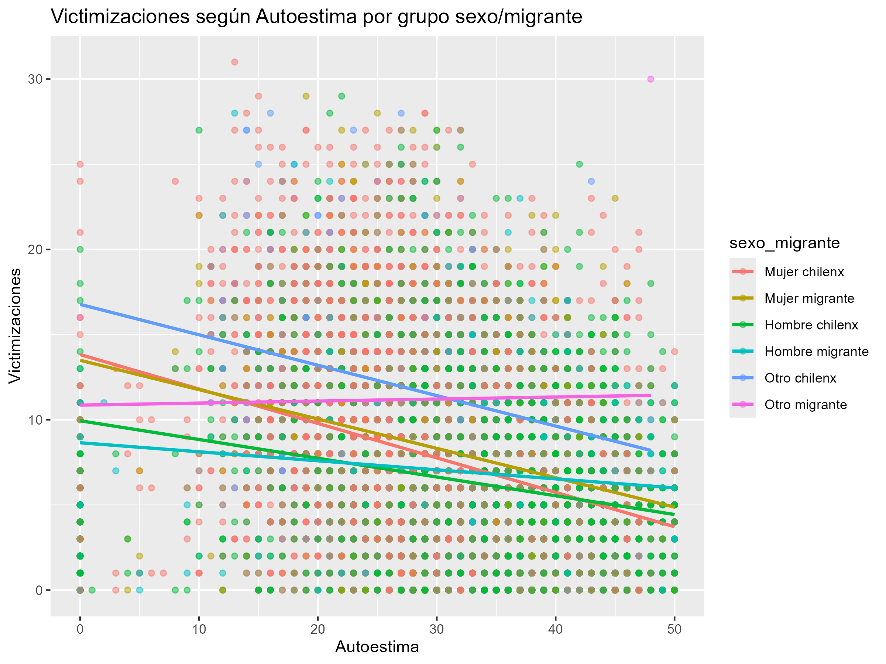
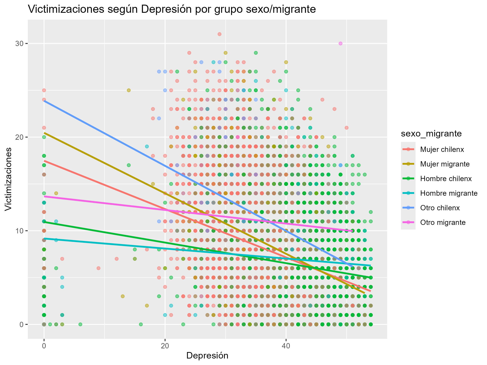

#### Base de datos y extracción de información

::: {.tiny .text-justify}
El análisis se basa en la Segunda Encuesta de Polivictimización en NNA 2023 (DESUC), que recoge información nacional sobre experiencias de violencia, salud mental y condiciones de vida en niños, niñas y adolescentes.
:::

----

#### Violencia y bienestar subjetivo de las infancias

::::: columns
::: {.column .tiny .text-justify}
#### Infancias en Chile

-    La violencia infantil en Chile es una problemática estructural y extendida: estudios muestran que más del 70% de NNA sufre algún tipo de maltrato [@galaz2019]. Esta situación se complejiza aún más en el caso de las infancias migrantes, quienes enfrentan formas específicas de exclusión y violencia simbólica, institucional y física.
:::

::: {.column .small .text-justify}
#### Polivictimización

-    El 10,93 % de los NNA en la muestra fueron clasificados como polivictimizados, al encontrarse en el percentil 90 o superior del total de victimizaciones reportadas. Este grupo concentra los niveles más altos de exposición acumulada a violencia, lo que implica mayores riesgos para su bienestar psicosocial.
:::
:::::

----

#### Construcción de variables

::::: columns
::: {.column .tiny .text-justify}
-    **Índice de Victimización** (V.D): El índice de victimización se construyó sumando 31 ítems dicotómicos sobre experiencias de violencia, tratándose como variable continua.

-    **Variable Sexo-Migrante:** variable binaria de migración y una combinada de género y origen para el análisis interseccional.
:::

::: {.column .tiny .text-justify}
-    **Escala de Autoestima** *(Rosenberg)*: se creó sumando ítems tipo Likert, invirtiendo los negativos para que mayor puntaje refleje menor autoestima

-    **Escala de Depresión** *(Birleson)*: se generó de forma similar, invirtiendo ítems positivos para que mayor puntaje indique más sintomatología depresiva.
:::
:::::

----

#### Resultados de Correlación: Relación entre Autoestima, Depresión y Victimizaciones

::: {.panel-tabset .tiny .text-justify}
#### Matriz de Correlación

{fig-align="center" width="553"}

Se observa una ***fuerte asociación*** entre depresión y baja autoestima (r = 0.734), y ***relaciones negativas más débiles*** con victimizaciones.

------------------------------------------------------------------------

#### Diagrama de Dispersión

{fig-align="center" width="611"}

A *mayor depresión* se asocia una ***menor autoestima***. Además, quienes reportan ***más victimizaciones*** tienden a concentrarse en niveles ***más altos de malestar psicológico*****.**
:::

-----

#### Resultados: Distribución de Victimizaciones controlado por grupos demograficos

::: {.panel-tabset .tiny .text-justify}
#### Autoestima

{fig-align="center" width="457"}

***A menor autoestima*** (mayor puntaje), ***aumentan las victimizaciones*** en todos los grupos. El grupo ***"otro chilenx"*** presenta **la asociación más fuerte.** Hay gran variabilidad individual.

------------------------------------------------------------------------

#### Depresión

{fig-align="center" width="488"}

Se observa una ***relación negativa*** entre s***íntomas depresivos y victimización***, con diferencias según sexo y migración. ***“Otro chilenx”*** destaca por ***mayor sensibilidad a esta relación.***
:::

-----

#### Conclusiones

::: {.incremental .tiny .text-justify}
-   El derecho internacional ha establecido obligaciones específicas para garantizar la protección integral de niñas y niños migrantes, especialmente en contextos de desprotección o irregularidad. [@ravetllatballesté2022]

-   La victimización se asocia sistemáticamente con menor autoestima y más síntomas depresivos en NNA.

-   Este impacto varía según género y migración, afectando más a personas no binarias y mujeres migrantes.

-   La polivictimización agrava el malestar psicosocial de forma acumulativa.

-   Se requiere un enfoque estructural que no solo prevenga la violencia, sino que fortalezca recursos de afrontamiento.

-   Futuras investigaciones deben priorizar variables más robustas, como la depresión, para un análisis más profundo.
:::

------
