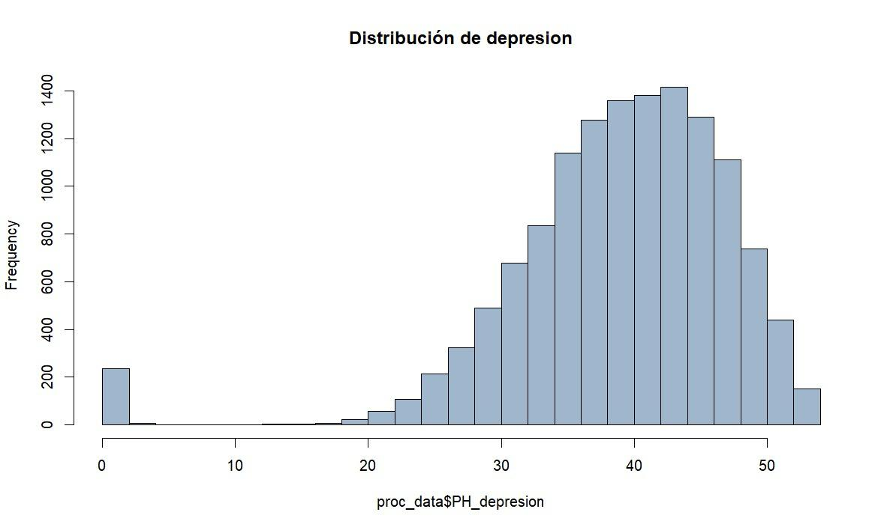
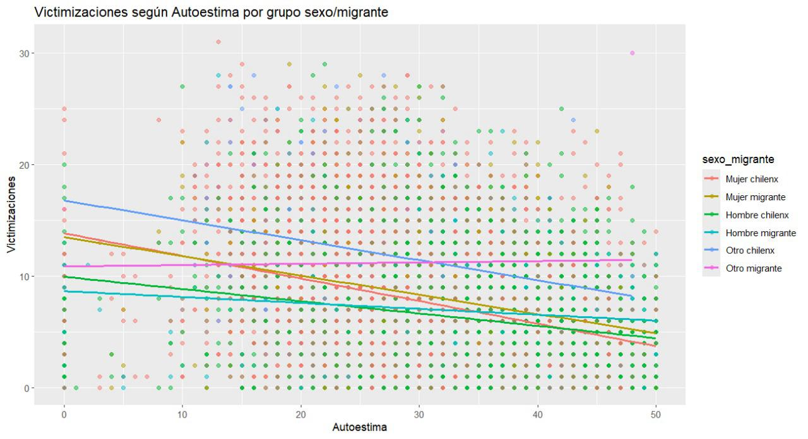

## Introduccion
::: {.small}

Este estudio examina la victimización de niños, niñas y adolescentes migrantes en Chile, poniendo especial atención en cómo el origen migratorio y el género —incluidas las identidades no binarias— condicionan su exposición a situaciones de violencia. A partir de un índice de victimizaciones y una variable que combina sexo y origen, los resultados revelan una mayor vulnerabilidad en NNA migrantes, especialmente en niñas y personas fuera del binario. Para reforzar la validez de los hallazgos, se aplicó ponderación muestral según el manual metodológico de DESUC.

:::

## Metodología
::::: columns
::: {.column width="50%"}
- **Fuente de datos**: Encuesta aplicada a NNA en Chile (base DESUC).
- **Variables principales**: 
  - Índice de victimización (0–31). ()
  - Autoestima (Escala de Rosenberg, recodificada).
  - Depresión (Escala de Birleson, recodificada).
:::

::: {.column width="50%"}
- **Variable combinada sexo_migrante**: incluye género no binario y origen migratorio.
- **Análisis**: descriptivos, visualización gráfica, correlaciones bivariadas.
- **Ponderación muestral** aplicada según manual metodológico de DESUC.
:::
:::::

## Diferencia entre polivictimizacion y victimizacion

Es importtante destacar la diferencia en entre estas dos y para distinguir la polivictimización de la victimización general, se utilizó el criterio del percentil 90 según las orientaciones de DESUC. Se consideró polivictimizados a los NNA que se ubican en el 10% superior de la muestra en cuanto a cantidad total de victimizaciones reportadas a lo largo de su vida. Esto permite identificar a quienes han estado expuestos a múltiples formas de violencia de manera acumulada, a diferencia de quienes han vivido una o pocas experiencias de victimización.

## Sintomatología depresiva

::::: columns
::: {.column width="50%"}
{width=100%}
::: 

::: {.column width="50%"}
Distribución asimétrica hacia la izquierda: la mayoría de los NNA presenta niveles **moderados a altos de síntomas depresivos**, concentrados entre 35–45 puntos. Algunos casos extremos con puntuaciones cercanas a 0 podrían reflejar respuestas atípicas.
:::
:::::

## Niveles de autoestima

::::: columns
::: {.column width="50%"}
{width=100%}
:::  

::: {.column width="50%"}
Distribución con leve asimetría negativa. La mayoría de los casos concentra puntuaciones entre 25 y 40, lo que indica **autoestima moderada a alta**. Un grupo reducido muestra **autoestima crítica**, con puntajes bajos.
:::
:::::

## Correlación entre variables clave

::::: columns
::: {.column width="50%"}
{width=100%} 
::: 

::: {.column width="50%"}
- Autoestima y Depresión: **correlación positiva alta** (r = 0.734).
- Victimización se asocia negativamente con ambas (r ≈ -0.30).
Esto sugiere que los NNA con **mayor malestar emocional** tienden a haber vivido **más experiencias violentas**.
:::
:::::

## Matriz de Correlación Mixta
::::: columns
::: {.column width="50%"}
{width=100%} 
:::

::: {.column width="50%"}
- Depresión y Autoestima: correlación positiva alta (r = 0.734).
- Victimización: se asocia negativamente con ambas (r ≈ -0.30), lo que indica que mayor malestar emocional se vincula con más experiencias de violencia.
:::
:::::

## Autoestima y Victimización por grupo

{width=200%}

## Autoestima y Victimización por grupo

- "Otro chilenx" presenta la relación más fuerte entre baja autoestima y alta victimización.
- Mujeres (migrantes y chilenas) muestran una relación moderada.
- Hombres (migrantes y chilenos) tienen menor victimización, pero la misma tendencia.
- "Otro migrante" muestra una relación más débil, posiblemente mediada por otros factores.

## Autoestima y Victimización por grupo

Este ultimo grafico muestra una relación negativa entre autoestima y victimización en todos los grupos: a menor autoestima, mayor victimización.
Esta tendencia es más fuerte en "otro chilenx", seguido por mujeres migrantes y chilenas.
Hombres migrantes y chilenos presentan niveles de victimización más bajos, pero mantienen la tendencia.
En "otro migrante", la relación es más débil.
Aunque el patrón es coherente con lo esperado, las correlaciones con victimización son moderadas (r ≈ -0.30), mientras que la correlación entre autoestima y depresión es alta (r = 0.734), indicando fuerte asociación entre ambas dimensiones del malestar psicológico.

## Conclusión

La victimización se asocia con menor autoestima y mayor depresión en NNA, especialmente en identidades no binarias y mujeres migrantes. La polivictimización muestra efectos acumulativos en el bienestar. Se requieren políticas con enfoque interseccional. Como limitación, se privilegió el análisis de autoestima sobre depresión, reduciendo la potencia explicativa del estudio.

