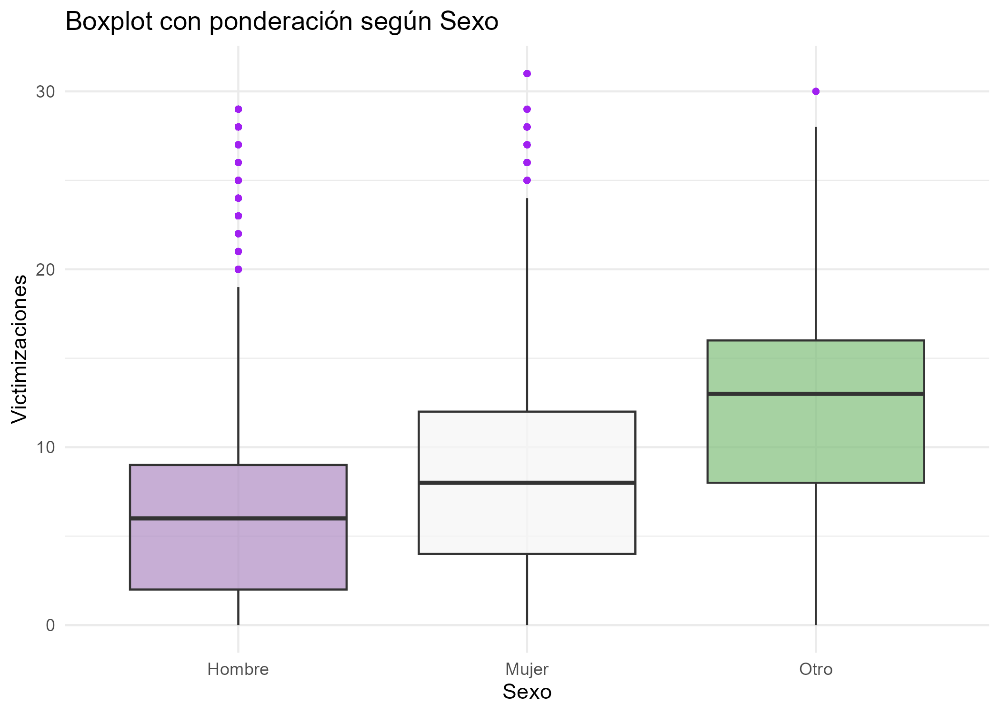
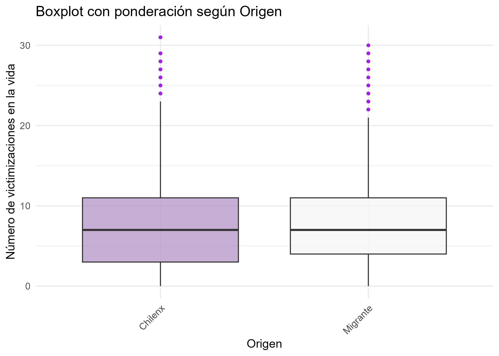
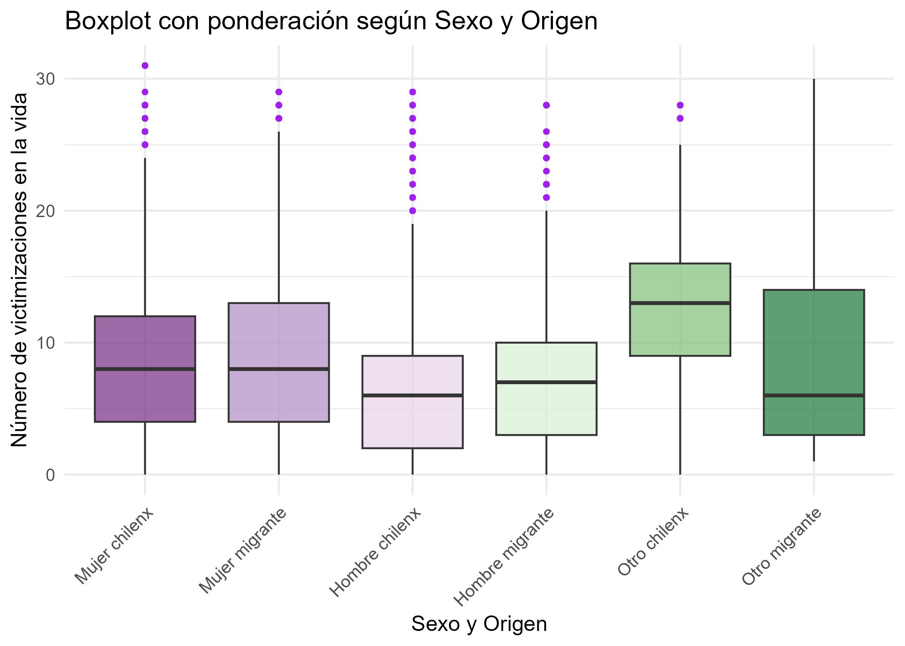

## Presentacion del caso:

## Desarrollo

### 

```{r}
# Cargar datos procesados
load("procesamiento/Trabajo1.RData")

```

### Tabla descriptiva ponderada

```{r}
# Cargar tabla ya guardada
tabla_final <- readRDS("output/tabla_final.rds")

# Mostrar tabla
knitr::kable(tabla_final, digits = 2, caption = "Tabla 1. Estadísticos descriptivos ponderados por grupo sexo_migrante")

```

The `echo: false` option disables the printing of code (only output is displayed

#### Graficos e interpretación

```{r}
### Gráfico 1: Boxplot según Sexo

```

).

```{r}
### Gráfico 2: Boxplot según Origen Migrante



```

```{r}

### Gráfico 3: Boxplot según Sexo y Origen


```

##### Conclusión
