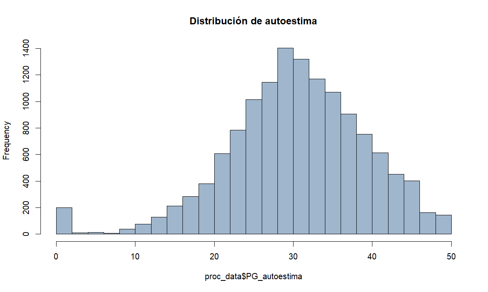
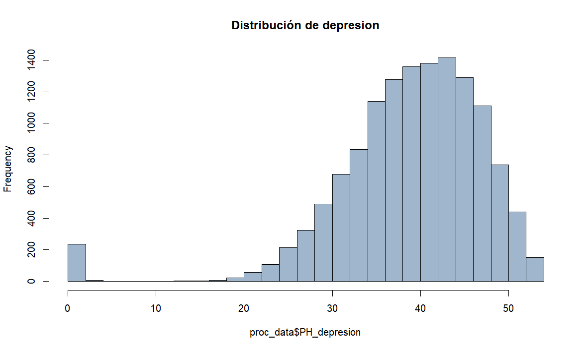
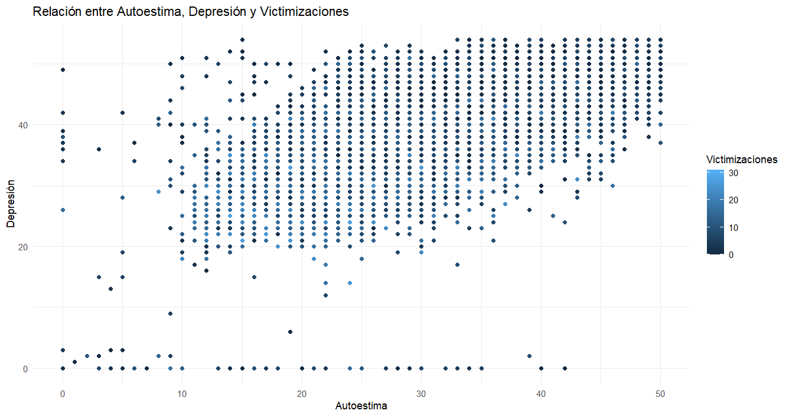
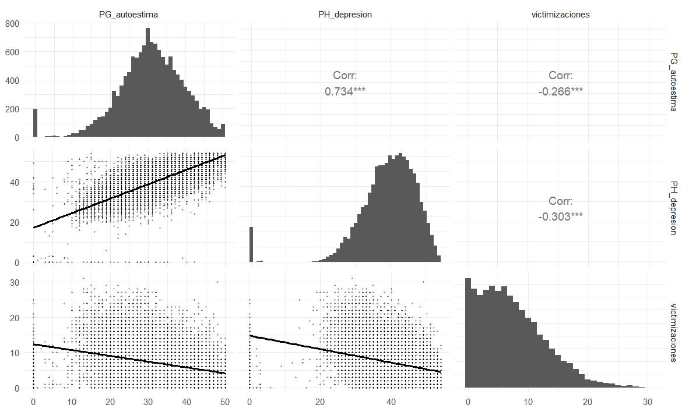
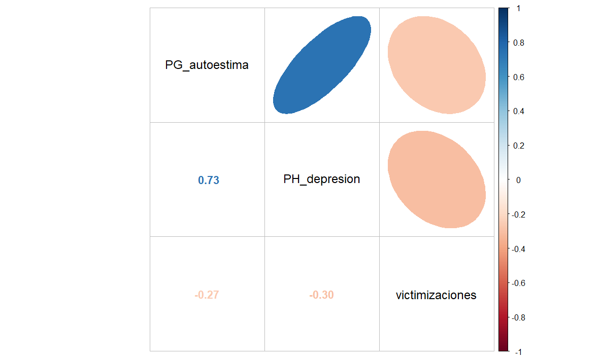
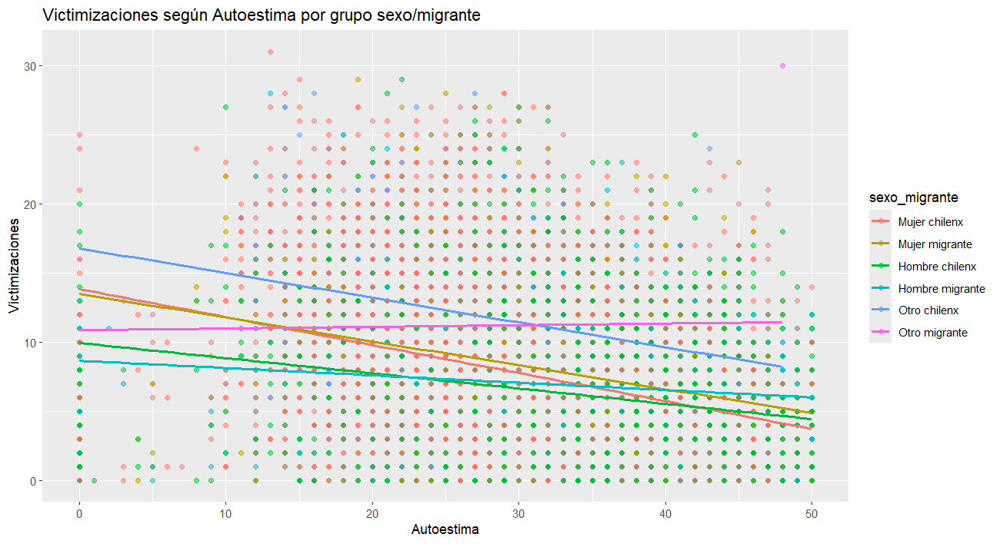

```{r}
# Cargar datos procesados
getwd()
load("procesamiento/Trabajo2.RData")
```

{width="106"}

## Introducción al Trabajo 2: Contextualización desde el Trabajo 1

El presente trabajo se enmarca como una continuidad del análisis iniciado en el Trabajo 1, donde se exploraron las experiencias de victimización percibida en niños, niñas y adolescentes (NNA´s) residentes en Chile, considerando como eje de comparación su origen migratorio y género.

En ese primer análisis, se contó con el indice de victimizaciones, con el objetivo de describir las diferencias en la exposición a situaciones de violencia y vulnerabilidad. Se consideró la unificacion de la variable "sexo_migrante", la cual distribuye sexo y origen (chileno/a o migrante), incluyendo una categoría adicional para quienes no se identifican con el binomio hombre/mujer, en atención a las posibilidades que ofrece la base de datos.

Los resultados indicaron que los NNA migrantes presentaban, en promedio, niveles más altos de victimización que sus pares chilenos. Particularmente, se observaron mayores niveles en niñas migrantes y en quienes se identificaron fuera del binario de género, aunque se advierte que los tamaños muestrales de algunos subgrupos son reducidos, lo que limita la generalización de los hallazgos. En este sentido, se utilizó ponderación muestral conforme a las recomendaciones del manual metodológico provisto por DESUC.

Si bien el análisis no permite establecer causalidad, los resultados sugieren la necesidad de seguir indagando en los factores asociados a estas diferencias, considerando tanto variables estructurales como institucionales. El Trabajo 2 busca avanzar en esta línea, examinando la relación entre las experiencias de victimización y el bienestar subjetivo, operacionalizado mediante escalas de autoestima (Rosenberg) y depresión (Birleson), controlando por sexo y origen migratorio.

Este enfoque permitirá aportar evidencia empírica sobre posibles vínculos entre violencia percibida y salud mental en infancias y adolescencias diversas, en un contexto donde los fenómenos migratorios presentan desafíos importantes para la garantía de derechos.

## Relevancia del Trabajo 2

Este segundo trabajo busca profundizar en la comprensión de los efectos que pueden tener las experiencias de victimización en la salud mental de niños, niñas y adolescentes en Chile, considerando diferencias por sexo y origen migratorio. A través del análisis de dos escalas psicológicas estandarizadas —una de autoestima y otra de síntomas depresivos— se pretende examinar en qué medida la exposición acumulada a situaciones de violencia (victimización) se relaciona con el bienestar subjetivo de las infancias.

Este enfoque permite vincular dimensiones estructurales y subjetivas, ofreciendo una perspectiva empírica que contribuya al diseño de intervenciones sensibles a las condiciones particulares que enfrentan NNA migrantes y no migrantes en contextos de desigualdad.

## Variable dependiente: sobre el Indice de Victimizaciones y su construcción

La variable dependiente principal en este análisis es un índice que resume la cantidad total de situaciones de victimización que cada NNA declara haber experimentado a lo largo de su vida. Este índice fue construido a partir de la suma de respuestas afirmativas a una serie de ítems incluidos en el módulo de victimización de la base de datos, los cuales representan distintos tipos de violencia (física, verbal, psicológica, entre otras).

Se aplicó un criterio de eliminación por pares (pairwise deletion), considerando únicamente aquellos casos con al menos una respuesta válida en las variables constitutivas del índice. El total de experiencias de victimización fue tratado como una variable continua, reflejando el nivel acumulado de exposición a violencia en la vida de cada individuo.

El índice muestra una distribución que va de 0 a 31 eventos de victimización, con una mediana de 6 y una media de 7.28. Los valores cuartílicos son los siguientes:

-    1er cuartil (Q1): 3 victimizaciones

-    Mediana (Q2): 6 victimizaciones

-    3er cuartil (Q3): 11 victimizaciones

Estos resultados son consistentes con lo observado en el Trabajo 1 y confirman la presencia de una proporción significativa de NNA con múltiples experiencias de victimización

####  ¿Cuál es el porcentaje para que las victimizaciones cobren el sentido de polivictimizacion?

Para operacionalizar el concepto de *polivictimización*, se siguieron las orientaciones teóricas (DESUC) que definen como polivictimizados a aquellos casos que se encuentran en el 10% (percentil 90) superior de la muestra en términos de la cantidad total de victimizaciones reportadas, tanto en la vida como en el último año (aunque este análisis se centrará en las victimizaciones de vida).

De acuerdo con este criterio, el 10.93% de la muestra presenta niveles de victimización suficientemente altos como para ser clasificados como polivictimizados, mientras que el 89.07% restante no alcanza ese umbral.

Este indicador permite identificar a un subgrupo de NNA que ha estado expuesto a múltiples formas de violencia de manera reiterada o acumulada, lo que puede tener consecuencias más severas sobre su bienestar emocional y desarrollo psicosocial.

## Construcción Escala de Autoestima

La escala de autoestima se construyó utilizando el conjunto de ítems correspondientes a la escala de Rosenberg, presente en la base de datos. Esta escala está compuesta por afirmaciones que evalúan la percepción general de autovaloración de los NNA, con opciones de respuesta tipo Likert.

Se recodificaron los ítems negativos para asegurar que una mayor puntuación reflejara consistentemente un menor nivel de autoestima. En otras palabras, mientras mas puntaje relacionado a una baja autoestima, mayor serán los niveles de la escala. Luego, se sumaron las puntuaciones individuales de los ítems válidos para cada caso, generando así una puntuación total de baja autoestima, tratada como una variable continua.

Esto se ejemplifica como en el siguiente caso:

-   **PG_2** = "Siento que tengo cualidades positivas" 1 Muy en desacuerdo

2 En desacuerdo

3 Ni en acuerdo ni en desacuerdo

4 De acuerdo

5 Muy de acuerdo

Donde la categoria de respuesta "muy de acuerdo" alude a mas autoestima

-   **PG_3**= "En general, tiendo a sentir que soy un fracaso" 1: Muy en desacuerdo

2: En desacuerdo

3: Ni en acuerdo ni en desacuerdo 4: De acuerdo

5: Muy de acuerdo

Mientras en PG_3, la respuesta "muy de acuerdo" alude a menos autoestima.

#### Figura 1: Histograma PG_autoestima (elaboración propia a partir de R)

{fig-align="center" width="498"}

#### Consistencia interna: Alfa de Cronbach para PG_autoestima

La escala de autoestima utilizada en este estudio presentó un **índice de confiabilidad alfa de Cronbach de 0.84**, lo que indica una **alta consistencia interna** entre los ítems. Este resultado sugiere que la escala mide de manera coherente el constructo de autoestima en la muestra de niños, niñas y adolescentes (NNA) considerados.

En general, todos los ítems mostraron una contribución adecuada a la confiabilidad total. No obstante, se identificó que el ítem **PG_8 (“Me gustaría tener más respeto conmigo mismo”)** presentó un rendimiento relativamente más bajo, con una correlación corregida con el total (r.drop) de 0.054. Esto indica que su relación con la puntuación total es más débil que la del resto de los ítems.

Si bien el impacto de este ítem no compromete la solidez general de la escala, su comportamiento estadístico sugiere que podría estar siendo interpretado de forma distinta por parte de los participantes. Esto podría deberse a su formulación en términos de un deseo o carencia, lo cual puede generar ambigüedad en la interpretación, especialmente en población infantojuvenil.

En conclusión, la escala muestra **buena fiabilidad** para evaluar autoestima en esta muestra, aunque sería recomendable revisar la redacción del ítem PG_8 en futuras aplicaciones para asegurar una alineación más clara con el resto de los enunciados.

## Construcción Escala de Depresión

La escala de depresión fue elaborada a partir de los ítems correspondientes a la escala de Birleson, diseñada para detectar síntomas depresivos en infancias y adolescencias. Esta escala incluye afirmaciones relacionadas con el estado de ánimo, la motivación y las relaciones sociales.

Se revisaron los valores y sentidos de cada ítem para asegurar la correcta orientación de las respuestas. Posteriormente, se sumaron las puntuaciones individuales para obtener un puntaje total de síntomas depresivos. Esta puntuación también fue tratada como una variable continua para efectos del análisis.

-   **PH_2** = "Siento ganas de llorar" 1: Nunca

2: A veces

3: Siempre

Donde "Siempre", se entiende como sintomatología depresiva.

-   **PH_16** = "Me animo fácilmente, me entusiasmo con mucha facilidad" 1: Nunca

2: A veces

3: Siempre

Mientras que PH_16, "Siempre" hace alución a menor depresión.

#### Figura 2: Histograma PG_depresion (elaboración propia a partir de R)

{fig-align="center" width="498"}

#### Consistencia interna: Alfa de Cronbach para PH_depresión

La escala de depresión construida a partir de los ítems de la Escala de Birleson mostró una **alta confiabilidad**, con un **alfa de Cronbach de 0.87**, lo que indica que los ítems presentan una **fuerte consistencia interna**. Este nivel de fiabilidad es adecuado para su uso en investigaciones que buscan evaluar síntomas depresivos en infancias y adolescencias.

El análisis sugiere que la mayoría de los ítems están bien alineados con el constructo teórico de la escala, aportando coherencia al conjunto. No obstante, se identificó que el ítem **PH_5 (“No me divierto cuando juego”)** presenta una **correlación corregida con el total baja (r.drop = 0.098)**, lo que indica una débil asociación con la puntuación global de síntomas depresivos. Además, si se eliminara este ítem, el alfa aumentaría ligeramente, lo que refuerza la idea de que su aporte a la escala es limitado.

Aunque su impacto sobre la confiabilidad total no es suficiente para desestimar el instrumento, su desempeño relativamente bajo sugiere que podría no estar siendo interpretado de forma consistente por los/as estudiantes, o bien que su relación con el estado emocional puede estar mediada por factores contextuales (por ejemplo, el tipo de juegos o el entorno social).

En resumen, la escala evidencia **una estructura confiable y sólida**, con la mayoría de los ítems funcionando adecuadamente. La revisión futura del ítem PH_5 podría contribuir a afinar aún más la precisión del instrumento.

## Sobre la Asociación de las variables

#### Figura 3: Grafico de correlación Autoestima y depresion, segun victimizaciones (elaboración propia a partir de R)



El diagrama de dispersión muestra una **relación positiva clara entre depresión y baja autoestima**, con una tendencia lineal ascendente: a mayor puntuación en la escala de depresión, también se observa una mayor puntuación en la escala de autoestima invertida, lo que en este caso indica **menor autoestima**. Esta relación es coherente con la literatura psicológica, donde se ha documentado ampliamente que la baja autoestima es un factor asociado al desarrollo de sintomatología depresiva. La nube de puntos está bastante concentrada, lo cual sugiere una **relación fuerte y consistente** entre ambas variables.

#### Figura 4:  Matriz de correlación (elaboración propia a partir de R)

{fig-align="center"}

La matriz de correlaciones, acompañada de histogramas, permite observar tanto la distribución individual de las variables como la fuerza y dirección de sus asociaciones. Se destaca una **correlación positiva alta entre depresión y baja autoestima (r = 0.734)**, consistente con estudios previos que muestran que personas con baja autoestima son más propensas a experimentar síntomas depresivos. En contraste, se observa una **correlación negativa débil entre victimizaciones y baja autoestima (r = -0.266)**, y una también negativa con depresión (r = -0.303). Esto indica que, a mayor número de victimizaciones reportadas, las personas tienden a tener **niveles más altos de autoestima** y **menores síntomas depresivos**, lo que **contradice expectativas teóricas**. Esta discrepancia podría reflejar una **posible subdeclaración de síntomas**, mecanismos de afrontamiento resilientes, o limitaciones en la sensibilidad de las escalas. Los histogramas, por su parte, muestran distribuciones sesgadas hacia valores bajos, especialmente en depresión, lo cual sugiere que la mayoría de las personas presentan niveles reducidos de sintomatología depresiva.

#### Figura 5: Matriz de correlación mixta (elaboración propia a partir de R)

{fig-align="center" width="498"}

El gráfico muestra una **relación negativa débil entre victimizaciones y baja autoestima**, lo que indica que, en esta muestra, quienes reportan más experiencias de victimización tienden a presentar **niveles más altos de autoestima**. Esta relación resulta **contraintuitiva**, ya que desde una perspectiva teórica se esperaría que mayores experiencias de victimización se asociaran a menor autoestima. Este resultado puede estar influido por factores contextuales como apoyo social, características del entorno escolar, o puede reflejar un fenómeno de adaptación psicológica en la muestra. No obstante, dada la debilidad de la correlación, es importante interpretar estos hallazgos con cautela y considerar posibles errores de medición o sesgos de autoinforme.

#### Figura 6: Grafico de dispersion controlado según sexo_migrante (elaboración propia a partir de R)

{fig-align="center"}

El gráfico presentado ilustra la relación entre los niveles de autoestima (eje x) y el número de victimizaciones experimentadas (eje y) en diferentes grupos demográficos, categorizados por sexo y condición migratoria. Es importante recordar que, según lo explicado, mayores puntuaciones en la escala de autoestima corresponden a una menor autoestima.

El gráfico muestra una clara tendencia negativa para todos los grupos analizados, lo que indica una relación inversa entre autoestima y victimizaciones: a medida que disminuye la autoestima (valores más altos en el eje x), se incrementa el número de victimizaciones reportadas. Esta relación es consistente en todos los grupos demográficos, aunque con variaciones significativas en la intensidad y punto de partida.

**Diferencias por grupo demográfico:**

-   La categoría "Otro chilenx" (línea azul): presenta la pendiente más pronunciada, comenzando con los niveles más altos de victimización cuando la autoestima es más alta (valores bajos en el eje x), y descendiendo notablemente conforme disminuye la autoestima.

-   Las mujeres, tanto chilenas como migrantes (líneas rosa y dorada respectivamente): muestran patrones similares con pendientes negativas moderadas, sugiriendo que ambos grupos experimentan un incremento comparable en victimizaciones a medida que su autoestima disminuye.

-   Los hombres, tanto chilenos como migrantes (líneas verde y turquesa): presentan niveles iniciales de victimización más bajos que las mujeres y la categoría "otro", aunque mantienen la misma tendencia negativa.

-   La categoría "Otro migrante" (línea violeta) muestra una pendiente menos pronunciada, lo que podría indicar que la relación entre autoestima y victimización es menos intensa para este grupo específico.

#### Sobre la dispersión

La nube de puntos muestra una considerable dispersión en todos los grupos, evidenciando importantes diferencias individuales dentro de cada categoría demográfica. Esta variabilidad sugiere que, aunque existe una tendencia general, otros factores no contemplados en el gráfico podrían estar influyendo en la relación autoestima-victimización.

#### Relación

Los resultados visualizados en el gráfico son coherentes con los constructos teóricos presentados en la investigación. La relación negativa entre autoestima y victimizaciones sugiere que las experiencias de violencia tienen un impacto acumulativo en el bienestar subjetivo de niños, niñas y adolescentes, manifestándose en menores niveles de autoestima cuando aumenta la exposición a situaciones victimizantes.

## Conclusión 

El análisis de las experiencias de victimización en niños, niñas y adolescentes (NNA) en Chile, en relación con autoestima, depresión y variables sociodemográficas, revela una situación compleja que requiere atención diferenciada.

Los resultados muestran que, en general, mayores niveles de victimización se asocian con menores niveles de autoestima en todos los grupos sexo/migrante, siendo esta relación más marcada en la categoría “Otro chilenx” y más moderada en mujeres migrantes y chilenas.

Sin embargo, la matriz de correlaciones muestra asociaciones negativas débiles entre victimizaciones y autoestima (r = -0.266) y entre victimizaciones y depresión (r = -0.303), lo que sugiere que, contra lo esperado, quienes reportan más victimizaciones tienden a presentar mayores niveles de autoestima y menos síntomas depresivos. Este hallazgo podría deberse a factores como mecanismos de resiliencia, subdeclaración de síntomas o limitaciones en las escalas utilizadas.

En contraste, la correlación entre baja autoestima y depresión es alta (r = 0.734), lo que valida el uso combinado de las escalas de Rosenberg y Birleson para evaluar el bienestar subjetivo en esta población.

Desde una perspectiva de vulnerabilidad, se identifican riesgos diferenciados según sexo y origen migrante. El grupo “Otro chilenx” presenta la relación más pronunciada entre victimización y baja autoestima, mientras que mujeres migrantes y chilenas muestran patrones similares con menor intensidad. Estos hallazgos coinciden con investigaciones previas que documentan mayor victimización en niñas migrantes y personas no binarias.

En cuanto a la polivictimización, definida como pertenecer al 10.93% superior en la suma de victimizaciones, se observa que ciertos grupos enfrentan mayor exposición a múltiples formas de violencia, con posibles impactos acumulativos en su bienestar psicosocial.

Los resultados subrayan la necesidad de intervenciones focalizadas que prevengan la victimización y refuercen factores protectores como la autoestima, especialmente en grupos vulnerables. Además, los hallazgos inesperados invitan a investigar más a fondo los mecanismos de afrontamiento y a revisar las herramientas de medición empleadas.

En suma, este estudio aporta evidencia relevante sobre cómo la victimización se vincula de forma diferenciada con el bienestar psicológico según identidad de género y condición migratoria, lo que refuerza la urgencia de políticas públicas interseccionales e inclusivas.
